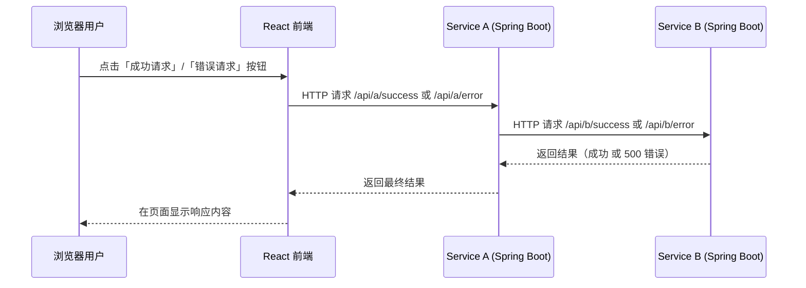
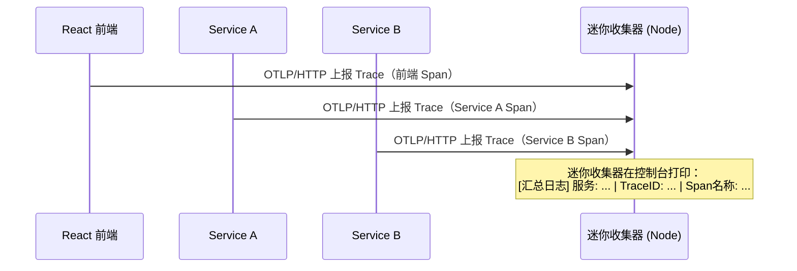

## 项目概览

这是一个极简的 OpenTelemetry 全链路 Demo，包括：

- **两个 Spring Boot 微服务（JDK 17）**
  - `service-a`：对外提供 REST 接口，调用 `service-b`
  - `service-b`：被 `service-a` 调用，提供成功/错误两个接口
- **一个 React + Vite 前端**
  - 提供「成功请求」「错误请求」两个按钮，调用 `service-a`
- **一个 Node.js 迷你收集器**
  - 实现 OTLP/HTTP `/v1/traces` 接口，将来自前端和两个后端的 Trace 汇总打印到控制台

你可以在本地使用 **JDK 17**、**Maven**、**Node.js / npm** 直接运行，也可以在 Windows 上用 PowerShell / CMD 按本说明操作。

## 总体链路（Mermaid 流程图）

### 请求调用链



### Trace 汇总链



## 目录结构

- **service-a**：Spring Boot 微服务 A
- **service-b**：Spring Boot 微服务 B
- **frontend**：React + Vite 前端
- **mini-collector**：Node.js 迷你收集器

---

## 一、准备工作

- 已安装 **JDK 17**
- 使用 IDEA 自带的 **Maven**（直接右键 `pom.xml` 即可）
- 使用 IDEA 自带的 **Node.js / npm**
- 手动下载 OpenTelemetry Java Agent（一个 `jar` 文件）

### 1. 下载 opentelemetry-javaagent.jar 到项目根目录

> 以下命令示例假设你已经在项目根目录（包含 `service-a`、`service-b` 等目录的那一层）执行：  
> PowerShell / CMD：`cd path\to\openTelemetry`

#### PowerShell 示例

```powershell
cd path\to\openTelemetry
curl -L https://github.com/open-telemetry/opentelemetry-java-instrumentation/releases/latest/download/opentelemetry-javaagent.jar -o opentelemetry-javaagent.jar
```

#### CMD 示例

```cmd
cd path\to\openTelemetry
curl -L https://github.com/open-telemetry/opentelemetry-java-instrumentation/releases/latest/download/opentelemetry-javaagent.jar -o opentelemetry-javaagent.jar
```

下载完成后，你的目录大致如下（使用**相对路径**）：

- `opentelemetry-javaagent.jar`
- `service-a\`
- `service-b\`
- `frontend\`
- `mini-collector\`
- ...

后续示例命令都假设你在项目根目录或各子目录中使用 **相对路径** 来引用这个 `opentelemetry-javaagent.jar`。

---

## 二、启动迷你收集器（Node.js）

路径：`mini-collector`

1. **安装依赖**

   （在项目根目录中打开 PowerShell / CMD）：

   ```powershell
   cd mini-collector
   npm install
   ```

2. **启动收集器**：

   ```powershell
   npm start
   ```

   控制台应看到：

   ```text
   迷你收集器已启动，监听端口 4318 (OTLP/HTTP)
   ```

---

## 三、启动后端服务（Spring Boot + OTEL Java Agent）

### 1. 构建 Jar

在项目根目录下，分别进入 `service-a` 和 `service-b` 目录执行 Maven 打包（PowerShell / CMD 均可）：

```powershell
cd service-a
mvn clean package

cd ..\service-b
mvn clean package
```

> 也可以直接在 IDEA 中右键 `pom.xml` 使用 Maven 视图执行 `package`。

### 2. 使用 Java Agent 启动（本地方式，Windows 命令示例）

#### Service A

假设你当前在项目根目录：

```powershell
cd service-a
java ^
  -javaagent:..\opentelemetry-javaagent.jar ^
  -DOTEL_TRACES_EXPORTER=otlp ^
  -DOTEL_EXPORTER_OTLP_ENDPOINT=http://localhost:4318 ^
  -DOTEL_EXPORTER_OTLP_PROTOCOL=http/json ^
  -DOTEL_SERVICE_NAME=service-a ^
  -jar target\service-a-0.0.1-SNAPSHOT.jar
```

服务默认监听 `8081`，提供接口：

- `GET http://localhost:8081/api/a/success`
- `GET http://localhost:8081/api/a/error`

#### Service B

同样使用根目录下载好的 `opentelemetry-javaagent.jar`，从 `service-b` 目录执行（仍然是**相对路径**）：

```powershell
cd service-b
java ^
  -javaagent:..\opentelemetry-javaagent.jar ^
  -DOTEL_TRACES_EXPORTER=otlp ^
  -DOTEL_EXPORTER_OTLP_ENDPOINT=http://localhost:4318 ^
  -DOTEL_EXPORTER_OTLP_PROTOCOL=http/json ^
  -DOTEL_SERVICE_NAME=service-b ^
  -jar target\service-b-0.0.1-SNAPSHOT.jar
```

服务默认监听 `8082`，提供接口：

- `GET http://localhost:8082/api/b/success`
- `GET http://localhost:8082/api/b/error`

> **调用链说明：**
> - 前端调 `service-a`
> - `service-a` 再调 `service-b`
> - 两个服务都通过 Java Agent 自动上报 Trace 到迷你收集器。

---

## 四、启动前端（React + Vite + OTLP 导出器）

路径：`frontend`

1. **安装依赖**

   ```powershell
   cd frontend
   npm install
   ```

2. **开发模式启动**

   ```powershell
   npm run dev
   ```

   Vite 默认监听 `http://localhost:5173/`。

3. **页面说明**

- 页面上有两个按钮：
  - **成功请求**：调用 `GET http://localhost:8081/api/a/success`
  - **错误请求**：调用 `GET http://localhost:8081/api/a/error`
- 前端通过 `src/tracing.js` 中的配置：
  - 使用 `@opentelemetry/sdk-trace-web` 采集浏览器侧 Span
  - 使用 `@opentelemetry/exporter-trace-otlp-http` 以 OTLP/HTTP 发送到 `http://localhost:4318/v1/traces`
  - 使用 `FetchInstrumentation` 自动为 `fetch` 请求生成 Span，并关联 TraceId

---

## 五、用 Docker 方式启动后端（可选）

前提：已经在 `service-a` 和 `service-b` 下执行过打包（见上文「三、启动后端服务」中的 Maven 命令）。

### 1. 构建镜像

```powershell
cd path\to\openTelemetry

# 将真实存在的 agent 复制到各服务目录，供 Dockerfile 使用（Windows 示例）
copy opentelemetry-javaagent.jar service-a\
copy opentelemetry-javaagent.jar service-b\

cd service-a
docker build -t service-a:demo .

cd ..\service-b
docker build -t service-b:demo .
```

### 2. 运行容器

```powershell
docker run --rm -p 8081:8081 `
  -e OTEL_TRACES_EXPORTER=otlp `
  -e OTEL_EXPORTER_OTLP_ENDPOINT=http://host.docker.internal:4318 `
  -e OTEL_EXPORTER_OTLP_PROTOCOL=http/json `
  -e OTEL_SERVICE_NAME=service-a `
  service-a:demo

docker run --rm -p 8082:8082 `
  -e OTEL_TRACES_EXPORTER=otlp `
  -e OTEL_EXPORTER_OTLP_ENDPOINT=http://host.docker.internal:4318 `
  -e OTEL_EXPORTER_OTLP_PROTOCOL=http/json `
  -e OTEL_SERVICE_NAME=service-b `
  service-b:demo
```

> 注意：这里通过 `host.docker.internal` 让容器内可以访问宿主机上的迷你收集器。

---

## 六、如何观察「汇总」效果？

1. **依次启动：**
   - 迷你收集器（Node）：`mini-collector`
   - 后端 `service-a` 和 `service-b`（本地或 Docker 方式均可）
   - 前端 Vite：`frontend`
2. 打开浏览器访问：`http://localhost:5173/`
3. 在页面上：
   - 点击一次 **「成功请求」** 按钮
   - 点击一次 **「错误请求」** 按钮

4. 查看迷你收集器终端：

   你会看到类似输出（顺序可能略有不同，但 **TraceID 相同**）：

   ```text
   [汇总日志] 服务: react-frontend | TraceID: 5e9b... | Span名称: GET http://localhost:8081/api/a/success
   [汇总日志] 服务: service-a      | TraceID: 5e9b... | Span名称: GET /api/a/success
   [汇总日志] 服务: service-b      | TraceID: 5e9b... | Span名称: GET /api/b/success

   [汇总日志] 服务: react-frontend | TraceID: 9a3c... | Span名称: GET http://localhost:8081/api/a/error
   [汇总日志] 服务: service-a      | TraceID: 9a3c... | Span名称: GET /api/a/error
   [汇总日志] 服务: service-b      | TraceID: 9a3c... | Span名称: GET /api/b/error
   ```

5. **这代表什么？**

- **TraceID 就是整条调用链的「身份证」**
  - 前端发起请求时生成 TraceId
  - 通过 HTTP 头部传播到 `service-a`、`service-b`
- **迷你收集器就是一个「合流点」**
  - 把来自前端、服务 A、服务 B 的 Span 汇总
  - 你在控制台里，能按 TraceId 把一次请求的全链路都看清楚
- **在真实生产环境**
  - 迷你收集器可以换成 Jaeger、Grafana Tempo 等专业存储
  - 它们提供 UI，可以根据 TraceId 展示漂亮的水滴/瀑布图

---

## 七、Spring Boot 快速集成 OpenTelemetry Java Agent（总结）

- **步骤 1：保持业务代码「零侵入」**
  - 正常写 Spring Boot 应用（就像本项目 `service-a`、`service-b`）
- **步骤 2：下载 Java Agent**
  - 下载 `opentelemetry-javaagent.jar` 放到服务目录或容器镜像中
- **步骤 3：启动命令加上 -javaagent 和 OTEL 环境变量**

示例：

```bash
java -javaagent:/Users/lei/Documents/code/openTelemetry/opentelemetry-javaagent.jar \
  -DOTEL_TRACES_EXPORTER=otlp \
  -DOTEL_EXPORTER_OTLP_ENDPOINT=http://localhost:4318 \
  -DOTEL_EXPORTER_OTLP_PROTOCOL=http/json \
  -DOTEL_SERVICE_NAME=your-service-name \
  -jar app.jar
```

- **步骤 4：确认收集器地址**
  - 本项目中收集器是 `http://localhost:4318`
  - 生产环境会换成真正的 OTLP Collector 地址

> 对于你当前这台机器来说，**真实使用的 Agent 文件就是**：  
> `/Users/lei/Documents/code/openTelemetry/opentelemetry-javaagent.jar`  
> 上面所有示例命令已经统一使用了这个实际存在的文件路径，你只需要按章节顺序复制运行即可。

这样，你就有了一套最小成本的 Spring Boot + OpenTelemetry 集成方案，可以在 IDEA + 本地 JDK17 环境里快速上手和演示。 


